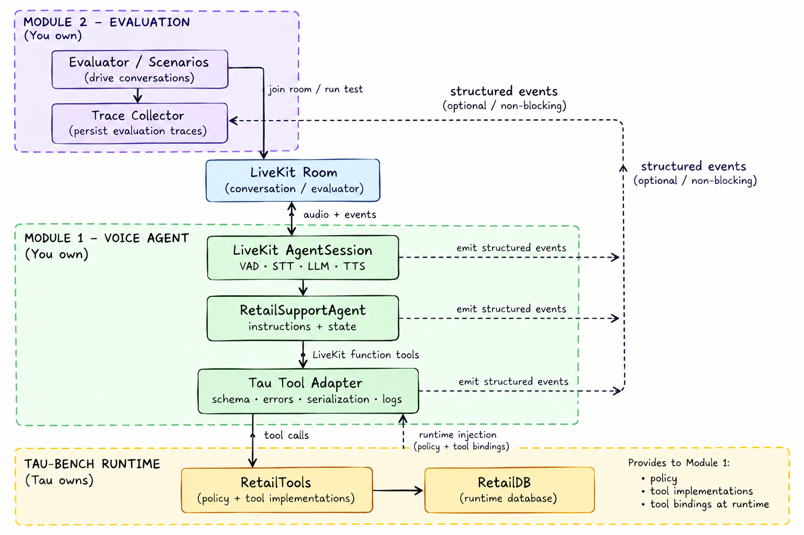

# Retail Agent Bench

This repository implements the initial boundaries for:

- **Module 1**: an importable retail support voice agent whose media and model runtime is
  LiveKit and whose policy, database, and tool implementations are supplied by tau at runtime.
- **Module 2**: a real-voice tau benchmark runner that owns task selection, normalized
  trajectories, scoring, artifacts, and deterministic failure clustering.



## Implemented boundary

- `LiveKit AgentSession` owns VAD, STT, LLM, TTS, interruptions, and room I/O.
- `RetailSupportAgent` owns the injected instructions and per-run metadata.
- `TauToolAdapter` preserves tau tool names and JSON schemas, serializes results, and emits
  non-blocking structured events.
- Tau owns the retail policy, `RetailTools`, and `RetailDB`. A fresh tau environment is created
  for each LiveKit room.
- Policy compliance is prompt-based. There is no middleware policy guard.
- Turn detection is explicitly VAD-only. No semantic turn detector is loaded.
- The tau orchestrator is not imported or used.

Module 2 joins one isolated LiveKit room per trial, drives the tau customer scenario over audio,
consumes Module 1 events, and applies tau scoring. It can run one to five rooms concurrently;
three is the default. Module 1 deliberately does not persist evaluation traces or run an
evaluator.

## Quick start

Follow the [local setup guide](docs/local-setup.md). In outline:

```bash
uv python install 3.12
uv sync --extra dev --extra tau
cp .env.example .env.local
uv run retail-voice-agent dev
```

The tau source checkout and `TAU2_DATA_DIR` step in the setup guide are required because tau's
wheel does not contain its benchmark data.

In a second terminal, inspect and run a selected task set:

```bash
uv run retail-eval list-tasks --split test
uv run retail-eval run --task-ids 5,9,12 --concurrency 3
```

Use task IDs printed by `list-tasks` when creating the final 20–30-task selection.

## Public API

```python
from retail_agent import create_livekit_session, create_retail_agent

agent = create_retail_agent(
    policy=runtime_policy,
    tools=db_bound_tau_tools,
    event_sink=optional_module_2_sink,
)
session = create_livekit_session(agent=agent)
```

The agent never reads or mutates the database directly. All database access is through the
injected tau tools.

See [Module 1 implementation notes](docs/module-1-implementation-notes.md) and
[Module 2 implementation notes](docs/module-2-implementation-notes.md) for architectural
decisions, contracts, artifact layout, and event flow.

## Quality checks

These checks validate the implementation; they are not substitutes for real voice evaluation.

```bash
uv run ruff format --check .
uv run ruff check .
uv run mypy src
uv run pytest
```
