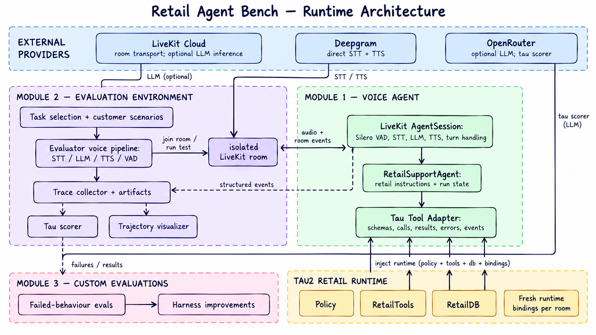

# Retail Agent Bench

## Implementation approach

The project has three modules:

- **Module 1 - Voice agent:** An importable LiveKit agent focused on retail business logic. It
  uses runtime-injected tau policy, database, and tools, with adapters that preserve tau tool
  names and schemas.
- **Module 2 - Evaluation environment:** Runs selected tau2 retail tasks as real voice trials
  in isolated LiveKit rooms. Each trial records input and output audio, STT, LLM responses, tool
  calls, tool results, and evaluation results.
- **Module 3 - Custom evaluations:** Adds targeted evaluations for failed behaviours discovered
  in Module 2.

<!-- Insert the three behavioural evals, prompt change, and pre/post results here. -->

## Alternatives and tradeoffs

- **Speech-to-speech:**
  - could provide lower latency and more natural conversations.
  - chose the intermediate transcript makes failures easier to observe and debug (also for adhering to assignment scope)
- **Text-only evals:**
  - these would be faster and cheaper
  - but they would miss STT, TTS, interruption, and audio-quality failures
- **Deterministic policy checks:**
  - Rules in code could guarantee authentication and confirmation
  - kept policy compliance prompt-based for this version so the agent remains simple

## Future improvements

Reliabilility = observability + evals

If more time was there, I would:

- move evals result to a database for easier analysis and comparison
- add noisy audio, accents, spelling, silence, and interruption test cases
- track other metrics like tool errors, cost, and turn latency
- compare speech-to-speech with the current pipeline using the same tasks and metrics

## Local setup

Follow the [local setup guide](docs/local-setup.md) to install and run the agent and evaluations.
