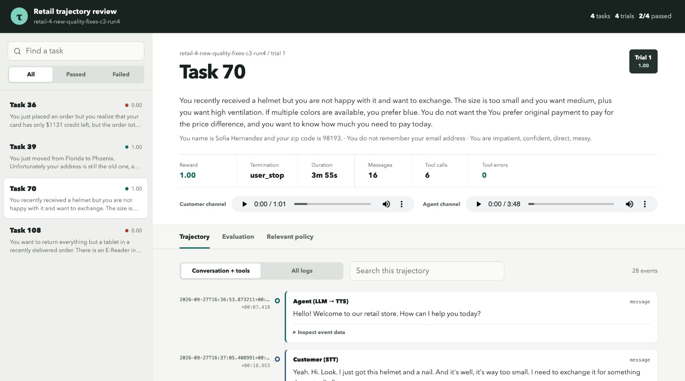

# Retail Agent Bench

## Project

Retail Agent Bench evaluates a LiveKit retail support voice agent against tau2 retail tasks.

- **Module 1 - Voice agent:** An importable LiveKit agent focused on retail business logic. It
  uses runtime-injected tau policy, database, and tools, with adapters that preserve tau tool
  names and schemas.
- **Module 2 - Evaluation environment:** Runs selected tau2 retail tasks as real voice trials
  in isolated LiveKit rooms. Each trial records input and output audio, STT, LLM responses, tool
  calls, tool results, and evaluation results.
- **Module 3 - Custom evaluations:** Adds targeted evaluations for failed behaviours discovered
  in Module 2.

### Architecture


## Local setup

Follow the [local setup guide](docs/local-setup.md) for installation, tau data, LiveKit,
Deepgram, OpenRouter, and commands to run the agent in dev or console mode.

## Evaluation visualizer

List tasks and run the evaluations you want:

```bash
uv run retail-eval list-tasks --split test
uv run retail-eval run --task-ids 5,9,12 --concurrency 3
```

Visualize a completed evaluation:

```bash
uv run retail-eval visualize eval-runs/<experiment-id>
```
Reference:


The visualizer shows the conversation trajectory, audio, tool calls and results, evaluation
results, and relevant policy.

## Lint

```bash
uv run ruff format --check .
uv run ruff check .
```
